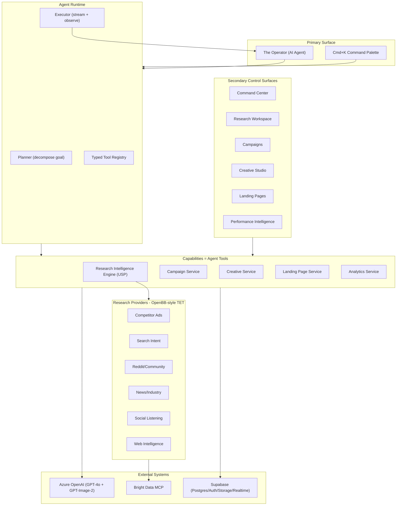
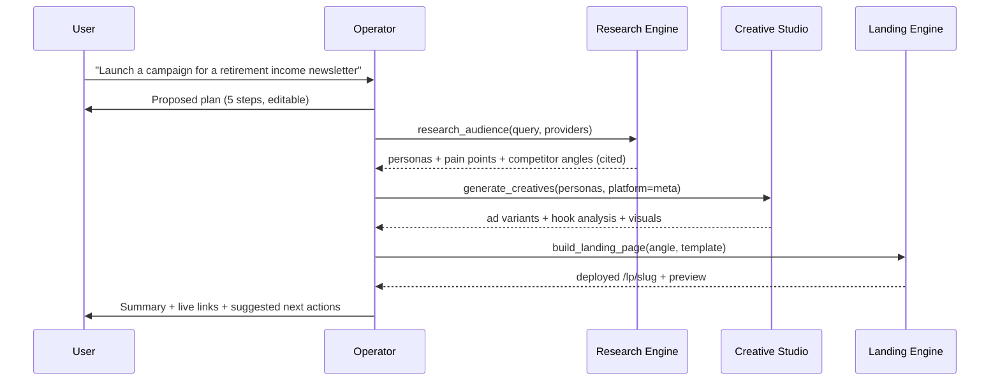

# MediaOS - The AI Media Buyer

## 1. Product Vision

MediaOS is not a dashboard with AI features. It is an **AI media buyer you can hire in a browser tab**.

At its center is the **Operator** - an autonomous agent that **plans, executes, monitors, and improves** marketing campaigns end to end. You give it a goal ("launch a campaign for a crypto newsletter targeting near-retirees"), and it researches the audience with real web data, synthesizes personas, generates platform-specific ad creatives, builds a deployable landing page, and then watches performance and recommends improvements - narrating its reasoning and citing its sources the entire way.

The Operator's exclusive moat is the **Audience Research Intelligence Engine**: an OpenBB-inspired "connect once, consume everywhere" system that aggregates live audience data (competitor ads, search intent, Reddit/community pain points, news, social listening) through Bright Data MCP and turns it into actionable intelligence that powers every downstream module.

**The primary surface is the agent.** Traditional screens (campaign tables, creative galleries, analytics charts) exist as secondary monitoring and control surfaces - the cockpit you drop into when you want manual control, while the agent does the heavy lifting.

## 2. Alignment to Judging Criteria

It's Today Media judges on four axes. Every decision in this plan maps to them.

| Judging Criterion | How MediaOS Wins It |
|---|---|
| **Problem selection** ("something that actually matters") | Targets the highest-leverage, least-automated step in their workflow - audience research - and wraps the entire funnel around it. The brief literally says "do the research"; we built the tool that does it. |
| **Does it work?** ("ugly and functional beats beautiful and broken") | Real data (Bright Data MCP), real AI (Azure GPT-4o + GPT-Image-2), real deploys (live landing pages), real persistence (Supabase). A judge can type a goal and watch the agent produce real artifacts on a live URL. |
| **Code quality** ("another engineer could extend it") | OpenBB-style provider abstraction (add a data source without touching the core), typed tool registry, strict TypeScript, Zod-validated boundaries, clean service layer, RLS-secured data. |
| **The README** ("how you think") | Three answers framed around insight: why research is the moat, how the agent makes every module compound, and a credible roadmap (closed-loop learning, live ad-platform APIs, an MCP server exposing MediaOS itself). |

## 3. Agent-Native Architecture



### The Operator (agent runtime)

- **Planner**: Decomposes a natural-language goal into an explicit, visible step plan (research -> personas -> creatives -> landing -> launch checklist). Shows the plan before acting - this is the "intelligently planning" perception.
- **Tool Registry**: Every platform capability is a typed, Zod-validated function the agent can call (`research_audience`, `synthesize_personas`, `generate_creatives`, `build_landing_page`, `analyze_performance`, `create_campaign`, ...). Adding a capability = registering a tool.
- **Executor**: Runs a plan -> execute -> observe loop. Each tool call streams to the UI as a live step, produces a **real artifact** (a persona, a creative set, a deployed page), and feeds its result back into the agent's context for the next step.
- **Transparency**: The agent narrates reasoning, shows which tool it is calling, and cites data sources for every research-derived claim.
- **Memory**: Conversations persist and are scoped to campaigns, so the agent has context across sessions ("continue the crypto-newsletter campaign").

### Agent execution loop



## 4. Tech Stack

- **Framework:** Next.js 15 (App Router, RSC, Server Actions, Streaming)
- **Language:** TypeScript strict, zero `any`
- **Agent/AI orchestration:** Vercel AI SDK (tool calling, streaming) over Azure OpenAI
- **AI models:** Azure OpenAI - GPT-4o (reasoning/copy/analysis) + GPT-Image-2 (visuals)
- **Data Intelligence:** Bright Data MCP (`@brightdata/mcp`) - SERP, scraping, structured platform data
- **Styling:** Tailwind CSS 4 + shadcn/ui (heavily customized, dark-first)
- **Database:** Supabase (Postgres + RLS, Auth, Storage, Realtime)
- **State:** Zustand (client) + TanStack Query (server state + optimistic updates)
- **Charts:** Recharts
- **Validation:** Zod (forms, API, AI/tool output parsing)
- **Icons:** Phosphor Icons (one family)
- **Animation:** Motion (`motion/react`), reduced-motion safe
- **Deployment:** Vercel + custom domain

## 5. Design Direction

Reading this as: **AI-native operations console for data-driven media buyers**, with a **dense, professional, dark-tech** language, leaning toward **heavily-customized shadcn/ui + Tailwind v4 + Geist**.

Dials: `DESIGN_VARIANCE: 5` / `MOTION_INTENSITY: 4` / `VISUAL_DENSITY: 7`

- Dark mode primary (zinc-950 base, never pure black); both modes QA'd
- Information-dense - data over whitespace; `font-mono` for all metrics
- Single locked accent color (emerald OR electric blue - NOT AI purple)
- Geist + Geist Mono; control hierarchy with weight/color, not giant H1s
- Keyboard-first: Cmd+K does everything; the Operator is always one keystroke away
- Streaming everywhere - agent reasoning, tool calls, copy generation render live
- Motion is motivated only (state transitions, feedback) - never decorative
- Linear/Vercel-tier polish; zero AI-slop tells (no em-dashes, no three-equal-cards, real images via GPT-Image-2)

## 6. Modules

### Module 0: The Operator (AI Agent) - the primary surface

The connective tissue and the headline feature.

- Persistent agent rail (always accessible) plus a full-screen agent view
- Goal-to-plan decomposition with an editable, visible plan
- Live tool-call execution with streamed reasoning and real artifacts
- Source citations on every research-derived claim
- Proactive mode: surfaces daily briefs, anomalies, and suggested next actions unprompted
- Improvement loop: detects underperformers and offers to regenerate/optimize
- Conversation history persisted and scoped to campaigns

### Module 1: Audience Research Intelligence Engine (THE USP)

The Operator's most powerful tool and the platform's moat. Applies OpenBB's "connect once, consume everywhere" pattern to audience intelligence.

**The problem it solves:** Audience research is the most time-consuming, least-automated step in media buying. Creative, landing pages, and analytics all have tools; unified, AI-native audience research does not.

**Provider abstraction (the engineering showpiece)** - mirrors OpenBB's TET (Transform-Extract-Transform) Fetcher:

```typescript
// Standard models = the provider-agnostic contract
interface AudienceSegment {
  demographics: { age_range; gender_split; income_bracket; education };
  psychographics: { values; interests; pain_points; aspirations };
  behaviors: { platforms; content_consumption; purchase_patterns };
  size_estimate: { range; confidence };
}
interface CompetitorAd { platform; advertiser; creative_type; copy; hooks_used; estimated_spend; date_range; engagement_signals }
interface TrendSignal { topic; velocity; volume; sentiment; source; time_series }

// Every source implements the same interface
abstract class ResearchProvider<Q extends QueryParams, D extends StandardModel> {
  abstract name: string;
  abstract transform_query(params: Q): ProviderQuery;   // T
  abstract extract_data(query: ProviderQuery): Promise<RawData>; // E (via Bright Data MCP)
  abstract transform_data(raw: RawData): D[];            // T
}
```

**Six providers (real data via Bright Data MCP):**

| Provider | Bright Data tools | Yields |
|---|---|---|
| Competitor Ad Research | `search_engine` + `scrape_as_markdown` (Meta Ad Library) | Competitor creatives, angles, active campaigns |
| Search Intent | `search_engine_batch` (related + "people also ask") | Rising topics, volume signals, seasonality |
| Reddit/Community | `search_engine` + `scrape_as_markdown` (free) or `web_data_reddit_*` (Pro) | Pain points in the audience's own words, vocabulary |
| News/Industry | `search_engine_batch` + `scrape_as_markdown` | Market shifts, regulation, competitive moves |
| Social Listening | `web_data_x_posts`/`tiktok_posts` (Pro) or `search_engine`+`scrape` (free) | Conversations, formats, share of voice |
| Web Intelligence | `scrape_batch` + `search_engine` | Competitor positioning, funnel structure |

> Tier note: `search_engine`, `search_engine_batch`, `scrape_as_markdown`, `scrape_batch` are verified working (free tier). `web_data_*` structured tools require the Pro account active; the orchestrator degrades gracefully to search+scrape when Pro is unavailable.

**AI Analysis layer (GPT-4o):** persona synthesis across all providers, competitive audience mapping, opportunity detection (high-pain/low-competition segments, pre-saturation trends, messaging gaps), and an audience-to-creative bridge that pipes exact pain points/vocabulary into the Creative Studio.

**Research Workspace UI:** saved/versioned research projects, OpenBB-Workspace-style multi-panel layout, per-insight source citations, progressive streaming as providers return, comparison mode, export to JSON/markdown.

### Module 2: Campaign System

AI brief builder powered by research. Persona import from the research engine, platform recommendations, budget allocation, templates (financial newsletter, ecommerce, SaaS), full draft/active/archived lifecycle. Each campaign is the hub linking research, creatives, pages, and analytics. Supports a "research first" flow.

### Module 3: AI Creative Studio

Research-informed, platform-ready creatives.

- Streaming copy for Google (30/90 char enforced, RSA), Meta (primary/headline/desc, multi-hook), TikTok (script hooks, overlays), Taboola (native curiosity)
- Hook psychological analysis (fear/curiosity/FOMO/social-proof/urgency) with confidence
- Research-powered hooks targeting the exact pain points the engine surfaced
- GPT-Image-2 visuals in correct aspect ratios (1:1, 9:16, 16:9, 1.91:1) to Supabase Storage
- Creative scoring vs DR best practices, variant management, brand-voice learning
- Export: Google Ads Editor CSV, Meta bulk upload, image downloads

### Module 4: Landing Page Engine

- 5 templates: squeeze, long-form sales, quiz funnel, advertorial, listicle
- AI generation from brief + research angle, DR frameworks (AIDA/PAS)
- Live preview (desktop/mobile), inline section editor, per-section regeneration
- One-click deploy to public `/lp/[slug]`, lead capture to Supabase, UTM tracking
- Built-in page analytics, A/B variants with auto-promote, financial compliance disclaimers

### Module 5: Performance Intelligence

- Realistic 90-day multi-platform seeder (fatigue curves, seasonality, platform behaviors) tied to demo creatives
- Metric cards, time-series, cross-platform comparison, funnel viz, creative-performance correlation
- AI daily brief, Z-score anomaly detection, recommendation engine - all fed back into the Operator's monitoring/improvement loop
- Export: PDF report, CSV

## 7. System Flow (end-to-end golden path)

```mermaid
flowchart LR
    Goal[User goal] --> Plan[Operator plans]
    Plan --> Research[Research Engine: real web data]
    Research --> Personas[AI personas + pain points + cited sources]
    Personas --> Brief[Campaign brief auto-filled]
    Brief --> Creatives[Creative Studio: copy + visuals + hooks]
    Personas --> Creatives
    Creatives --> Landing[Landing page generated + deployed]
    Landing --> Live["Live /lp/slug + lead capture"]
    Live --> Analytics[Performance Intelligence]
    Analytics --> Improve[Operator: anomalies + recommendations]
    Improve --> Creatives
```



The flywheel: research informs creatives and pages; analytics informs the agent; the agent refines research and regenerates the weakest assets. Every loop makes the next campaign smarter.

## 8. Complete Database Schema (Supabase / Postgres)

All tables carry `id uuid pk`, `user_id uuid` (RLS scoped to `auth.uid()`), `created_at`, `updated_at`. Indexes on every FK and on date columns used by analytics.

```sql
-- Agent
agent_conversations (id, user_id, campaign_id, title, status, created_at, updated_at)
agent_messages (id, conversation_id, role, content, tool_calls jsonb, tool_results jsonb, created_at)
agent_runs (id, conversation_id, goal, plan jsonb, status, artifacts jsonb, created_at)

-- Research (USP)
research_projects (id, user_id, campaign_id, name, query, status, created_at, updated_at)
audience_personas (id, project_id, name, demographics jsonb, psychographics jsonb, behaviors jsonb, pain_points jsonb, buying_triggers jsonb, size_estimate jsonb, confidence, sources jsonb)
competitor_ads (id, project_id, platform, advertiser, creative_type, copy, hooks jsonb, estimated_spend, date_range, image_url)
trend_signals (id, project_id, topic, velocity, volume, sentiment, source, time_series jsonb, detected_at)
community_insights (id, project_id, source_url, platform, content, pain_point_extracted, sentiment, upvotes, posted_at)
research_sources (id, project_id, provider, url, title, fetched_at, raw_data jsonb, confidence)

-- Campaigns + creative
campaigns (id, user_id, name, status, brief jsonb, platform_config jsonb, budget jsonb, persona_ids jsonb)
creatives (id, campaign_id, platform, type, content jsonb, hook_type, hook_confidence, score, is_favorite, rating, version)
creative_images (id, creative_id, storage_path, aspect_ratio, platform, prompt_used)
brand_voices (id, user_id, name, sample_ads jsonb, tone_profile jsonb)

-- Landing pages
landing_pages (id, campaign_id, slug unique, template_type, sections jsonb, html_content, status, deployed_at)
page_views (id, landing_page_id, visitor_id, utm jsonb, referrer, created_at)
leads (id, landing_page_id, email, name, utm jsonb, ip_address, created_at)

-- Analytics
performance_metrics (id, campaign_id, creative_id, platform, date, impressions, clicks, conversions, spend, revenue, cpa, ctr, cvr, roas)
anomalies (id, campaign_id, metric, severity, description, detected_at, resolved_at)
ai_insights (id, campaign_id, type, content, confidence, actioned, created_at)
```

## 9. Project Structure

```
src/
  app/
    (auth)/login, register
    (dashboard)/layout + sidebar + agent rail
      page.tsx                 -- command center
      operator/                -- full-screen agent view
      research/[projectId]/
      campaigns/[id]/
      creatives/
      landing-pages/
      analytics/
    lp/[slug]/                 -- public deployed landing pages
    api/                       -- webhooks, exports, cron, lead capture
  components/ ui/ layout/ agent/ research/ campaign/ creative/ landing-page/ analytics/
  lib/
    agent/
      runtime.ts               -- plan -> execute -> observe loop
      tools.ts                 -- typed tool registry (Zod schemas)
      prompts.ts
    research/                  -- the OpenBB-inspired core
      providers/ (competitor-ads, search-intent, reddit, news, social, web-intel).ts
      standard-models/         -- AudienceSegment, CompetitorAd, TrendSignal, ...
      registry.ts              -- provider registration + discovery
      orchestrator.ts          -- parallel execution + merge
      analyzer.ts              -- AI synthesis (personas, opportunities)
      brightdata.ts            -- MCP client wrapper + graceful degradation
    ai/ services/ analytics/ seed/ supabase/ validators/ utils/
  hooks/ stores/ types/
```

## 10. Demo Narrative (the scripted wow path)

Judges spend minutes, not hours. The live URL opens on a **pre-seeded financial-newsletter scenario** (It's Today Media's actual vertical) so relevance is obvious in under 30 seconds. The scripted path:

1. Land on Command Center - a real campaign ("Retirement Income Weekly") already has research, creatives, a live landing page, and 90 days of analytics.
2. Open the Operator, type: *"Find a fresh angle for near-retirees worried about inflation and build me 3 Meta ads."*
3. Watch the agent show a plan, run real research (Bright Data), stream cited pain points, synthesize a persona, generate 3 hook-analyzed ad variants with GPT-Image-2 visuals.
4. Say *"Build a landing page for the strongest angle"* - agent deploys a real `/lp/...` page the judge can open on their phone and submit a lead.
5. Open Performance Intelligence - the AI daily brief flags an anomaly and recommends scaling a creative; the agent offers to act on it.

Every step produces a real, clickable artifact. Nothing is faked.

## 11. Build Sequence

1. **Foundation** - scaffold, Supabase schema + RLS + Auth, design system, layout shell + agent rail
2. **Operator core** - tool-calling runtime, streaming chat UI with visible plans, conversation persistence
3. **Research Engine core** - provider abstraction, registry, orchestrator, Bright Data wrapper
4. **Research providers + AI** - six providers, persona synthesis, opportunity detection, citations
5. **Research UI** - workspace, persona cards, source panels, comparison, streaming
6. **Agent tools wiring** - expose research as the agent's first real tool; prove the loop end to end
7. **Campaign system** - research-powered brief builder, CRUD, campaign hub
8. **Creative Studio** - copy (streaming, hook analysis), visuals (GPT-Image-2), scoring, export
9. **Landing Page Engine** - generation, editor, deploy, lead capture, A/B
10. **Performance Intelligence** - seeder, dashboard, AI brief, anomaly detection, recommendations
11. **Agent orchestration** - full multi-step workflows, proactive monitoring + improvement loop
12. **Demo seed + Integration + Polish** - financial-newsletter scenario, command palette, a11y, both-mode QA
13. **Ship** - Vercel + custom domain, README, recorded walkthrough, performance + live QA

Every phase ends the same way (see section 17): write and run its tests, update the relevant `Docs/` page plus `Docs/learnings.md`, then `git add`/`commit`/`push` with a Conventional Commit message.

## 12. Risk Analysis + Mitigations

| Risk | Impact | Mitigation |
|---|---|---|
| Bright Data Pro `web_data_*` inactive | Lose structured social tools | Orchestrator degrades to `search_engine` + `scrape_as_markdown` (verified working); architecture is provider-agnostic |
| Scraping reliability / rate limits | Research stalls mid-demo | Cache research results to Supabase; pre-seed the demo scenario so a live fetch is a bonus, not a dependency |
| Azure OpenAI rate/latency | Slow agent, bad demo | Stream tokens, cache persona/creative outputs, set timeouts + retries (`error-resilience`), keep seeded fallbacks |
| Agent tool-loop errors/hallucinated args | Broken actions | Zod-validate every tool input/output; tools fail safe with structured errors the agent can recover from |
| Scope (5 modules + agent) | Unfinished surfaces | Vertical slices: agent + research is a complete, demoable product on its own; each later module adds depth, not blockers |
| Cost (scraping + image gen) | Budget overrun | Cache aggressively; cap image gen per request; reuse seeded artifacts in the demo |
| Financial-content compliance | Credibility | Auto-generate disclaimers on landing pages; label AI estimates as estimates |

## 13. Verification Strategy (prove-it + verification-before-completion)

Iron law: no completion claim without fresh verification evidence. Run the command, read the full output and exit code, THEN claim. Every phase ends with a fresh `tsc --noEmit`, `next lint`, test run, and `build` - outputs shown, never assumed or extrapolated.

- **Agent loop:** scripted goal produces a valid plan, executes >=3 real tool calls, and yields real artifacts - shown live, not asserted.
- **Research providers:** each provider returns normalized standard-model data from a real Bright Data call (recorded fixtures for tests).
- **Creatives:** generated copy respects platform char limits (unit-tested); images land in Storage at correct aspect ratios.
- **Landing pages:** deployed `/lp/[slug]` returns 200, captures a lead row, and is mobile-usable.
- **Analytics:** seeder produces plausible distributions; anomaly detector flags injected anomalies.
- **End-to-end:** Playwright covers the golden path (goal -> research -> creative -> landing -> lead).
- **Quality gates:** strict typecheck, lint, Lighthouse (LCP < 2.5s, INP < 200ms, CLS < 0.1) before "done."

## 14. Non-Functional Requirements

- **Security:** Supabase RLS on every table; secrets server-side only; tool inputs validated; public `/lp` routes isolated from authed data.
- **Performance:** RSC by default, stream all AI, optimistic UI, indexed analytics queries.
- **Reliability:** retries + timeouts + circuit breakers on Azure and Bright Data; graceful provider degradation.
- **Observability:** structured logs for agent runs and tool calls; every research insight is source-traceable.
- **Accessibility:** WCAG AA contrast, focus rings, keyboard nav, reduced-motion honored.

## 15. README Strategy (winning answers)

**What does this tool do?** MediaOS is an AI media buyer. Its Operator agent plans, executes, monitors, and improves campaigns end to end - powered by a first-of-its-kind Audience Research Intelligence Engine that aggregates live web data (competitor ads, search intent, Reddit pain points, news, social) the way OpenBB aggregates financial data, then turns it into personas that drive real ad creatives, deployed landing pages, and performance intelligence.

**Why did you build THIS one?** Every team has creative tools and dashboards. Nobody has an automated system that actually does the audience research - the highest-leverage, least-automated step in media buying. The brief said "do the research." I built the agent that does it, cites its sources, and makes every downstream tool compound. The research engine is the moat; the agent is what turns a pile of tools into a teammate.

**What would you build next?** Live ad-platform APIs (Google/Meta/TikTok) feeding real performance back into the research engine for closed-loop learning; real-time competitive monitoring with alerts; audience cohort tracking over time; CRM/LTV correlation; and an MCP server that exposes MediaOS itself, so their existing AI stack can call the Operator. Every new provider makes the whole platform smarter - exactly the OpenBB compounding effect.

## 16. Quality Standards Applied (Active Skill Usage)

Per `.cursor/skills/README.md` (the 88-skill operating manual), the build ACTIVELY invokes skills: read and follow each `SKILL.md`, never name-drop. Defaults that fire on every relevant action:

- `elite-execution-philosophy` / `max-effort` - staff-engineer bar on every implementation
- `ai-native-product-thinking` - the agent IS the product, not a bolted-on chat widget
- `consumer-product-improvement` - 5-persona walkthrough on every surface
- `design-taste-frontend` / `ui-ux-pro-max` - anti-slop dark-tech aesthetic, zero AI tells
- `research-first-execution` - real prior art (OpenBB) studied and applied
- `grill` - resolve unknowns before building a module
- `self-review` + `ai-debt-detector` - reviewed before shown; audit AI-gen code for swallowed errors and hallucinated deps
- `tdd` - red-green-refactor for core logic (char limits, anomaly detection, providers, seeder)
- `prove-it` + `verification-before-completion` - evidence before any "done"
- `error-resilience` - retries/timeouts/fallbacks on every external call
- `git-workflow` - atomic Conventional Commits, push after each meaningful unit
- `db-schema` / `supabase-postgres-best-practices` - queries-first, RLS, indexes
- `web-perf` - measure-first before claiming fast

Per-module compound recipe: `grill` -> `research-first-execution` -> implement -> `self-review` + `ai-debt-detector` -> write tests (`tdd`) -> `prove-it` -> commit + push (`git-workflow`) -> update docs + learnings.

## 17. Engineering Practices (Active Discipline)

Mandatory throughout the build, in every phase and every subagent.

### 17.1 Active skill usage
Before each module, identify applicable skills from `.cursor/skills/README.md`, read the `SKILL.md`, and follow its process. Following the skill is the standard you are held to, not an optional ritual.

### 17.2 Testing discipline (tests are not optional)
- Unit: pure logic - platform char-limit enforcement, hook classification parsing, Z-score anomaly detection, provider `transform_query`/`transform_data`, seeder distributions, zod schema parsing.
- Integration: research orchestrator merge across providers (recorded Bright Data fixtures, no live calls in CI); agent tool execution against service stubs; lead-capture write path.
- E2E (Playwright): the golden path - goal -> research -> persona -> creative -> landing -> lead.
- Framework: Vitest (unit/integration) + Playwright (e2e). Co-locate unit tests as `*.test.ts`. CI-safe: no network, deterministic seeds, mocked AI and Bright Data.
- Gate: a module is not done until its tests are written AND pass on a fresh run, with evidence shown (see section 13).

### 17.3 Reference docs (maintain `Docs/`)
Keep living documentation, updated in the SAME change that alters behavior (no drift):
- `Docs/architecture.md` - system and data-flow diagrams
- `Docs/adr/NNN-title.md` - one ADR per significant decision (Azure provider, research provider abstraction, RLS strategy, agent runtime)
- `Docs/research-engine.md` - provider contract and how to add a provider (the extensibility story for judges)
- `Docs/api.md` - server actions and route contracts
- `Docs/runbook.md` - env setup, run, seed, deploy

### 17.4 Learnings (capture continuously)
Maintain `Docs/learnings.md`: after any correction, non-obvious fix, or gotcha (Tailwind v4, Azure deployment quirks, Bright Data tiers, RLS pitfalls, git concurrency), append a dated entry: problem -> root cause -> rule. Never repeat a class of mistake twice.

### 17.5 Git workflow (commit and push actively)
- Conventional Commits (`feat:`, `fix:`, `test:`, `docs:`, `chore:`, `refactor:`), imperative subject <=50 chars, body explaining why.
- Commit after each meaningful, working unit (not one giant commit); each commit must build/typecheck.
- Push after each phase and after notable units. A phase is complete only when its work is committed AND pushed.
- Never commit secrets: `.env.local` stays git-ignored; only `.env.example` is committed.
- Follow `git-workflow`; respect git guardrails (no force-push to shared history, no destructive resets).
- Concurrency safety: when multiple subagents run in parallel they MUST NOT run git simultaneously (`.git/index.lock` corruption). Either commit sequentially after each completes, or assign git to a single committer.
