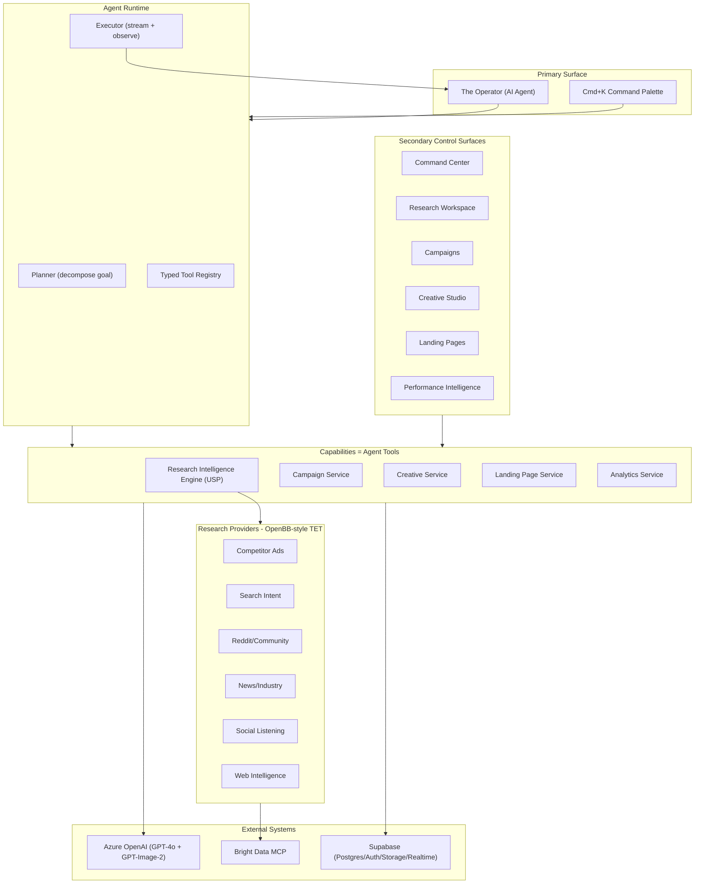
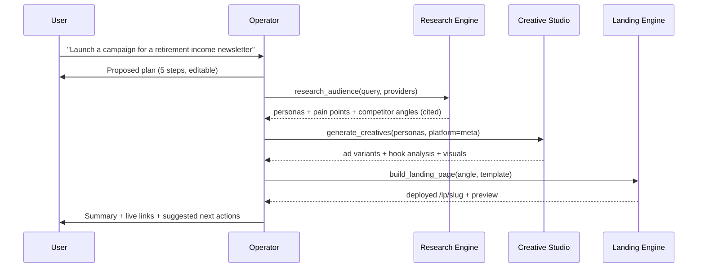

# MediaOS Architecture

MediaOS is an **AI-native media buying platform**. The headline product is **the Operator** - an
autonomous agent that plans, executes, monitors, and improves marketing campaigns end to end. Its
moat is the **Audience Research Intelligence Engine**, an OpenBB-inspired "connect once, consume
everywhere" system that turns live web data (via Bright Data) into personas, pain points, and
competitive intelligence that power every downstream module.

The agent is the **primary surface**. Traditional CRM screens (campaign tables, creative galleries,
analytics dashboards) are **secondary control surfaces** - the cockpit you drop into for manual
control while the agent does the heavy lifting.

This document is the map. For the rationale behind individual choices see the
[ADRs](./adr/). For the research extensibility story see [research-engine.md](./research-engine.md).

---

## 1. Agent-Native Architecture

Every platform capability is exposed to the Operator as a typed, Zod-validated **tool**. The same
service layer that backs the manual screens backs the agent, so the agent and the cockpit can never
drift apart.



**Reading the diagram.** A goal enters through the Operator (or Cmd+K). The runtime decomposes it
into a visible plan, then the Executor calls tools one at a time, streaming reasoning and producing
real artifacts. Tools are thin wrappers over the **service layer** (`src/lib/services`) and the
**research engine** (`src/lib/research`); both call the external systems through resilient clients
(`src/lib/ai`, `src/lib/research/brightdata.ts`, `src/lib/supabase`).

---

## 2. Agent Execution Loop

The loop is **plan -> execute -> observe**. Each tool call streams to the UI as a live step,
produces a persisted artifact, and feeds its result back into the agent's context for the next step.



Tool inputs and outputs are validated with Zod at the boundary (`defineTool` in
`src/lib/agent/types.ts`), so a hallucinated argument fails safe with a structured error the agent
can recover from rather than crashing the run. See [ADR 0004](./adr/0004-agent-runtime.md).

---

## 3. System Flow (end-to-end golden path)

```mermaid
flowchart LR
    Goal[User goal] --> Plan[Operator plans]
    Plan --> Research[Research Engine: real web data]
    Research --> Personas[AI personas + pain points + cited sources]
    Personas --> Brief[Campaign brief auto-filled]
    Brief --> Creatives[Creative Studio: copy + visuals + hooks]
    Personas --> Creatives
    Creatives --> Landing[Landing page generated + deployed]
    Landing --> Live["Live /lp/slug + lead capture"]
    Live --> Analytics[Performance Intelligence]
    Analytics --> Improve[Operator: anomalies + recommendations]
    Improve --> Creatives
```



**The flywheel.** Research informs creatives and pages; analytics informs the agent; the agent
refines research and regenerates the weakest assets. Every loop makes the next campaign smarter -
the same compounding effect OpenBB gets from adding financial data providers.

---

## 4. Code Topology

```
src/
  app/
    (auth)/login, register          -- public auth
    (dashboard)/                    -- protected cockpit (sidebar + agent rail)
      page.tsx                      -- command center
      operator/ research/ campaigns/ creatives/ landing-pages/ analytics/
    lp/[slug]/                      -- public deployed landing pages
  lib/
    agent/        -- typed tool registry, tool authoring (defineTool), prompts, run/plan types
    research/     -- OpenBB-inspired engine: standard-models, provider (TET), registry,
                     orchestrator, brightdata adapter, analyzer
    services/     -- campaign / creative / landing / analytics service contracts
    validators/   -- Zod schemas for forms, API, and AI/tool output parsing
    ai/           -- Azure OpenAI client (chat + image), resilient
    supabase/     -- browser, server (RSC), and middleware clients
    env.ts        -- lazy, non-crashing env loader + is*Configured() predicates
    errors.ts     -- typed AppError hierarchy (code + retriable)
    resilience.ts -- withTimeout, withRetry (backoff + jitter), CircuitBreaker
    logger.ts     -- structured logging
  proxy.ts        -- Next.js route protection (the "middleware" convention in Next 16)
supabase/migrations/
  0001_init.sql   -- 19 tables + indexes + RLS policies
  0002_storage.sql-- storage buckets + path-scoped object policies
```

### Layering rules

1. **UI / tools never touch external SDKs directly.** They go through the service layer or the
   research engine, which go through the resilient clients.
2. **Every external boundary throws typed errors** (`src/lib/errors.ts`) and is wrapped in
   `withRetry` / `withTimeout` (`src/lib/resilience.ts`).
3. **The app boots without credentials.** `getEnv()` never throws; clients check
   `is*Configured()` and raise a typed `ConfigurationError` only at the point of real use, so demo
   reviewers see a "configure credentials" state instead of a crash.
4. **Secrets are server-only.** The service-role Supabase client and Azure key live behind
   server modules; only `NEXT_PUBLIC_*` values reach the browser.

---

## 5. Data Model (19 tables)

All tables carry `id uuid pk`, a denormalized `user_id` (RLS scoped to `auth.uid()`), timestamps,
and indexes on every FK + analytics date column. Full DDL: `supabase/migrations/0001_init.sql`.

| Domain | Tables |
|---|---|
| Agent | `agent_conversations`, `agent_messages`, `agent_runs` |
| Research (USP) | `research_projects`, `audience_personas`, `competitor_ads`, `trend_signals`, `community_insights`, `research_sources` |
| Campaigns + Creative | `campaigns`, `creatives`, `creative_images`, `brand_voices` |
| Landing pages | `landing_pages`, `page_views`, `leads` |
| Analytics | `performance_metrics`, `anomalies`, `ai_insights` |

`campaigns` is the hub: research, creatives, landing pages, and analytics all reference it. RLS
strategy (owner-scoped + public landing-page read + anonymous lead/view insert) is documented in
[ADR 0003](./adr/0003-rls-strategy.md).

---

## 6. External Systems

| System | Used for | Client | Degradation |
|---|---|---|---|
| **Azure OpenAI** | GPT-4o reasoning/copy (Vercel AI SDK), GPT-Image visuals (REST) | `src/lib/ai/azure.ts` | `ConfigurationError` when unset; retries + timeouts on every call |
| **Bright Data MCP** | SERP + scraping (free), structured platform data (Pro) | `src/lib/research/brightdata.ts` | Pro `web_data_*` degrades to free `search_engine` + `scrape_as_markdown` |
| **Supabase** | Postgres + RLS, Auth, Storage, Realtime | `src/lib/supabase/*` | App boots read-only/"configure" state when unset |

See [ADR 0001](./adr/0001-tech-stack.md) for why each was chosen.
